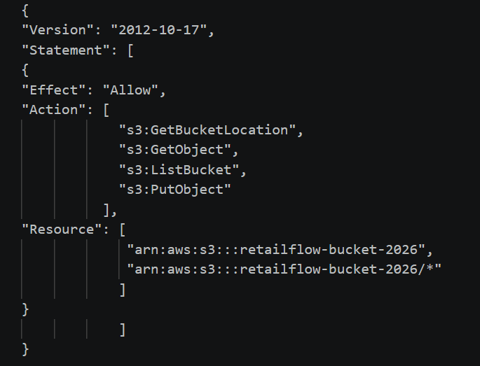
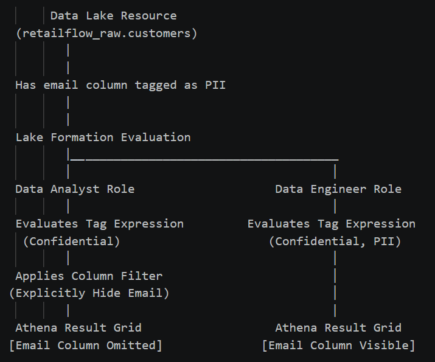
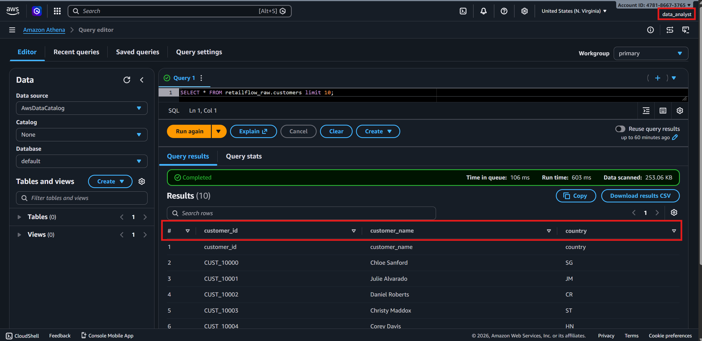
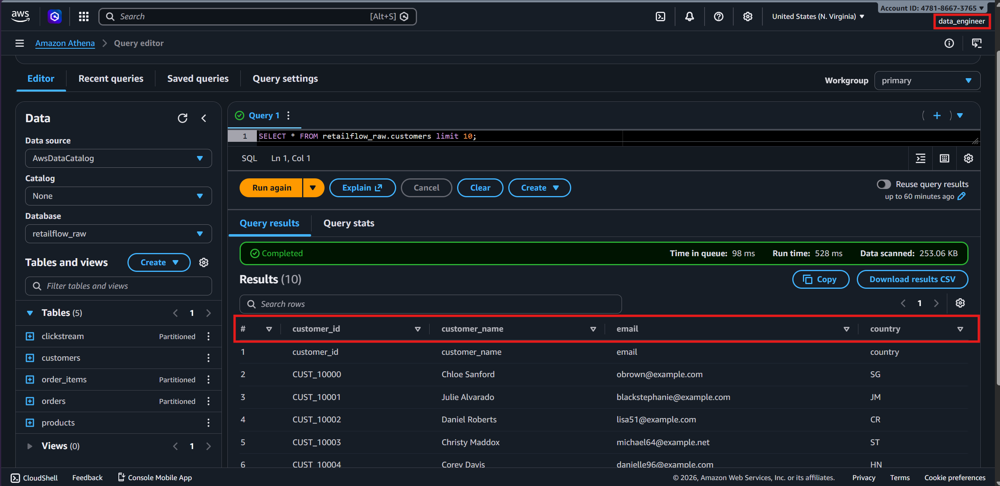

--------------------------------
Lake Formation Governance Report
--------------------------------

1. Create IAM Users & Attach Managed Policies
* Go to IAM -> Users -> Create User.
    
    User 1: data_analyst
       * Attach Managed Policy: AmazonAthenaFullAccess
       * Attach Managed Policy: AWSGlueConsoleFullAccess

    User 2: data_engineer
       * Attach Managed Policy: AmazonAthenaFullAccess
       * Attach Managed Policy: AWSGlueConsoleFullAccess
       * Attach Managed Policy: AWSLakeFormationDataAdmin (Only for the engineer)

* Add Inline S3 Policy (Athena_S3_Access)
Attach this inline JSON policy to both users so they can use Athena and write query results to your S3 bucket.

         
--------------------------------------------------------------------------------------------------------------------------------------------------------------------------------------------------

2. Data Lake Permission Mapping

 

--------------------------------------------------------------------------------------------------------------------------------------------------------------------------------------------------

3. Data Lake Permission Mapping
Access permissions are evaluated dynamically via Lake Formation Tag expressions combined with column exclusions.

   Data_engineer Persona:
   * Tag Expression: data_sensitivity = PII, Confidential, Public
   * Permissions: SELECT, DESCRIBE
   * Scope: All Columns

   Data_analyst Persona:
   * Tag Expression: data_sensitivity = Confidential, Public
   * Permissions: SELECT, DESCRIBE
   * Scope: Excluding Column: email

--------------------------------------------------------------------------------------------------------------------------------------------------------------------------------------------------
 
4. Security Access Verification Proof
Both personas executed the identical query block within AWS Athena to validate compliance constraints against data exposure:

   * Data Analyst Query Execution Proof
     The access boundary successfully isolates the PII metadata. The column is completely redacted/invisible from the execution response.
     

   * Data Engineer Query Execution Proof
     The data administrative layer permits full transparency into the data catalog, displaying the plaintext emails as intended.
     

--------------------------------------------------------------------------------------------------------------------------------------------------------------------------------------------------

Note: The default virtual group IAMAllowedPrincipals has been explicitly Revoked at both the database and table layers to disable legacy IAM bypasses.