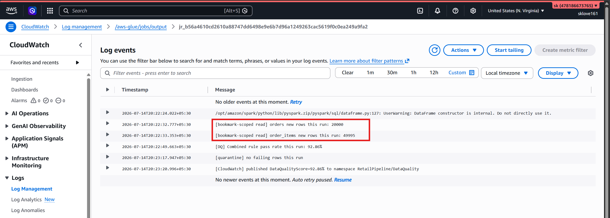
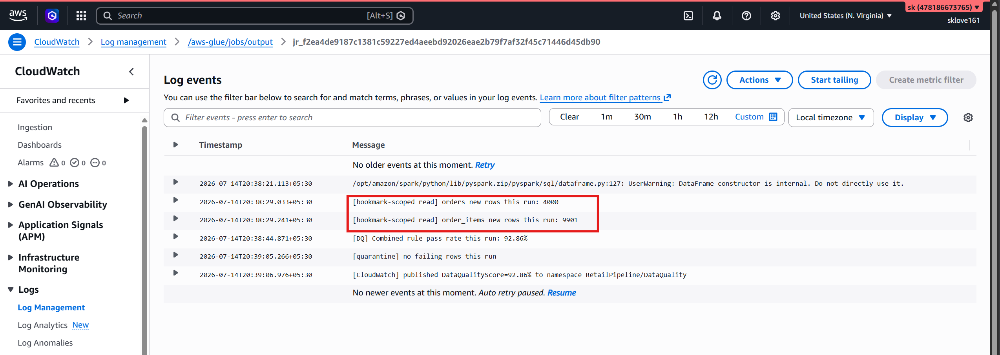

# AWS Glue Bookmarks Proof
This file proves that AWS Glue Job Bookmarks are working correctly and only processing new data.

### Day 1 Run

Log Lines:
* [bookmark-scoped read] orders new rows this run: 20000
* [bookmark-scoped read] order_items new rows this run: 49995

### Day 2 Run

Log Lines:
* [bookmark-scoped read] orders new rows this run: 4000
* [bookmark-scoped read] order_items new rows this run: 9901

## Conclusion
Because the Day 2 run only processed the new rows instead of repeating Day 1's data, the Glue Job Bookmark mechanism is fully verified and working.