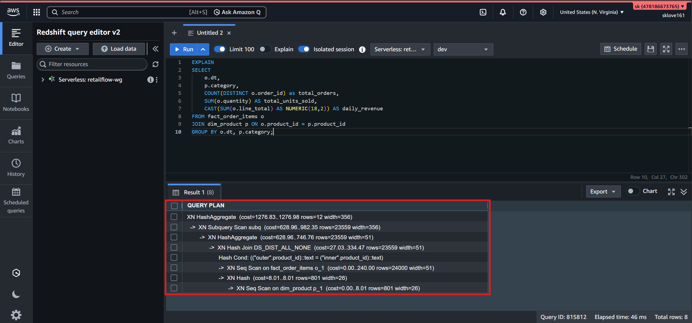

##EXPLAIN plan

* The plan reveals that Redshift executes the operation via a highly optimized DS_DIST_ALL_NONE Hash Join, meaning no data redistribution or network broadcasting was required across the cluster nodes because the smaller dim_product table is duplicated across all compute nodes (DISTSTYLE ALL).

* The cluster performs sequential scans (Seq Scan) on both tables, hashes the dim_product records into memory, and evaluates the product_id key matches against the 24,000 incoming rows of fact_order_items.

* Finally, a two-stage HashAggregate group-by sequence summarizes the data fields into 12 highly condensed, unique combinations of dt and category text keys before outputting the metrics.
